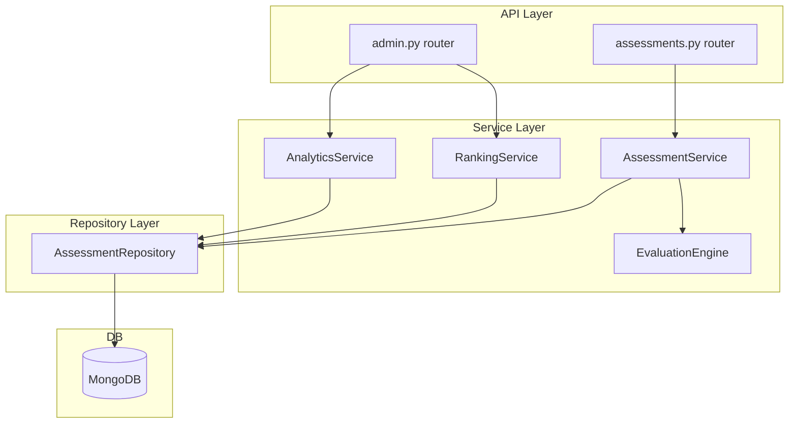
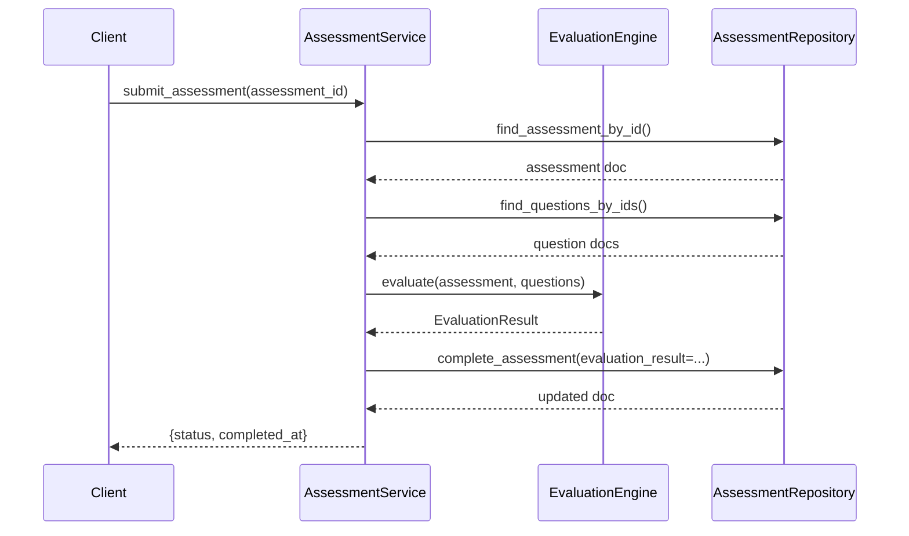

# Design Document — Assessment Evaluation Engine

## Overview

The Assessment Evaluation Engine adds weighted scoring, per-level performance tracking, classification, and persisted evaluation snapshots to the Kodie platform. It computes a structured `evaluation_result` sub-document atomically on assessment completion and exposes admin-facing APIs for results, analytics, and ranking.

The design follows the existing layered architecture strictly: new pure-function services receive their dependencies via constructor injection, repositories return plain dicts, and all domain errors are raised as `AppError`.

### Key Design Decisions

- **Pure scoring functions**: `EvaluationEngine` is a stateless service class with pure methods — no I/O, no side effects. This makes it trivially testable and reusable.
- **Atomic snapshot write**: The `complete_assessment` repository method is extended to accept an optional `evaluation_result` dict and writes it in the same `find_one_and_update` call, preserving the existing atomicity guarantee.
- **Clean `assessment_type` rename**: `AssessmentLevel` is renamed to `AssessmentType` and `Assessment.level` is renamed to `Assessment.assessment_type` as a complete, clean rename across all layers — no fallback, no legacy field.
- **`build_geral_question_ids` enforces exactly 5 per level**: The existing function is updated to raise `NO_QUESTIONS_FOR_LEVEL` when fewer than 5 questions exist for any canonical level, replacing the current dynamic `n // 4` split.
- **Admin routes are a separate router**: All `/admin/*` endpoints live in `backend/app/api/routes/admin.py` and require a separate admin auth dependency, keeping student-facing routes unchanged.
- **Stub repositories in tests**: All tests use hand-written in-memory stub repositories — no mocking libraries, no real DB.

---

## Architecture



**Data flow on submit:**



---

## Components and Interfaces

### EvaluationEngine

`backend/app/services/evaluation_engine.py`

Stateless service. All methods are pure functions (no I/O).

```python
class EvaluationEngine:
    WEIGHTS: dict[str, int] = {
        "iniciante": 2, "junior": 3, "pleno": 4, "senior": 5
    }
    SCORE_MAX: dict[str, int] = {
        "iniciante": 40, "junior": 60, "pleno": 80, "senior": 100, "geral": 70
    }
    CANONICAL_LEVELS: tuple[str, ...] = ("iniciante", "junior", "pleno", "senior")
    ACCURACY_THRESHOLD: float = 0.70

    def evaluate(
        self,
        *,
        assessment: dict,          # raw assessment document from MongoDB
        question_docs: list[dict], # raw question documents from MongoDB
    ) -> "EvaluationResult": ...

    def _compute_score(
        self,
        answers: list[dict],
        question_by_id: dict,
    ) -> tuple[int, int, int, int]: ...
    # returns (score_total, correct_count, incorrect_count, dont_know_count)

    def _compute_performance_by_level(
        self,
        answers: list[dict],
        question_by_id: dict,
        assigned_ids: list,
    ) -> dict[str, "LevelPerformance"]: ...

    def _classify(
        self,
        assessment_type: str,
        score_percent: float,
        performance_by_level: dict[str, "LevelPerformance"],
    ) -> tuple[str, str]: ...
    # returns (classification_kind, classification_value)
```

### AssessmentService (extended)

`backend/app/services/assessment_service.py`

Constructor gains `evaluation_engine: EvaluationEngine` parameter.

`submit_assessment` is extended to:
1. Fetch question docs for all assigned question IDs.
2. Call `evaluation_engine.evaluate(assessment=..., question_docs=...)`.
3. Pass the resulting snapshot dict to `repository.complete_assessment(evaluation_result=...)`.

`create_assessment` is updated to accept `assessment_type` instead of `level`, persist it as `assessment_type`, and route `geral` to `build_geral_question_ids`.

`get_current_assessment` returns `assessment_type` in place of `level` in all response dicts.

### question_selection (updated)

`backend/app/services/question_selection.py`

`build_geral_question_ids` is updated to enforce exactly 5 questions per canonical level. When any canonical level has fewer than 5 questions available, it raises `AppError(status_code=409, code="NO_QUESTIONS_FOR_LEVEL")`. The dynamic `n // 4` split is removed.

```python
def build_geral_question_ids(question_docs: list[dict]) -> list[ObjectId]:
    """Selects exactly 5 questions per canonical level (20 total).
    Raises NO_QUESTIONS_FOR_LEVEL if any level has fewer than 5 questions."""
    PER_LEVEL = 5
    buckets: dict[Category, list[dict]] = {cat: [] for cat in CATEGORY_ORDER}
    for q in question_docs:
        cat = normalize_category(q.get("category", ""))
        if cat in buckets:
            buckets[cat].append(q)

    for cat in CATEGORY_ORDER:
        if len(buckets[cat]) < PER_LEVEL:
            raise AppError(
                status_code=409,
                code="NO_QUESTIONS_FOR_LEVEL",
                message=f"Não há questões suficientes para o nível {cat.value}.",
            )

    selected: list[dict] = []
    for cat in CATEGORY_ORDER:
        bucket = sorted(buckets[cat], key=lambda q: q.get("number", 0))
        selected.extend(bucket[:PER_LEVEL])

    return [q["_id"] for q in selected]
```

### RankingService

`backend/app/services/ranking_service.py`

```python
class RankingService:
    def __init__(self, repository: AssessmentRepository): ...

    async def rank_by_type(
        self,
        *,
        assessment_type: str,
        page: int,
        page_size: int,
    ) -> "RankingPage": ...

    async def rank_global(
        self,
        *,
        page: int,
        page_size: int,
    ) -> "RankingPage": ...
```

Sorting is applied in the repository query (MongoDB `sort`) for efficiency; tie-breaking is expressed as a compound sort key.

### AnalyticsService

`backend/app/services/analytics_service.py`

```python
class AnalyticsService:
    def __init__(self, repository: AssessmentRepository): ...

    async def get_analytics(
        self,
        *,
        assessment_type: str | None = None,
    ) -> "AnalyticsResult": ...
```

Aggregation is performed via MongoDB aggregation pipeline delegated to the repository. The service assembles the final `AnalyticsResult` from the raw pipeline output.

### AssessmentRepository (extended)

New and updated methods:

```python
async def create_assessment(
    self,
    *,
    student_id: str,
    assigned_question_ids: list[ObjectId],
    assessment_type: str,   # renamed from level
    now: datetime,
) -> dict: ...

async def complete_assessment(
    self,
    *,
    assessment_id: ObjectId,
    completed_at: datetime,
    evaluation_result: dict | None = None,  # NEW — written atomically
) -> dict | None: ...

async def find_questions_by_ids(
    self, *, question_ids: list[ObjectId]
) -> list[dict]: ...  # already exists

async def list_completed_assessments(
    self,
    *,
    assessment_type: str | None = None,
    classification_value: str | None = None,
    page: int = 1,
    page_size: int = 20,
) -> tuple[list[dict], int]: ...  # NEW — for admin results + ranking

async def aggregate_analytics(
    self,
    *,
    assessment_type: str | None = None,
) -> dict: ...  # NEW — runs aggregation pipeline
```

All existing repository methods that previously filtered or projected on `"level"` are updated to use `"assessment_type"`.

### Admin Router

`backend/app/api/routes/admin.py`

| Method | Path | Description |
|--------|------|-------------|
| GET | `/admin/results` | Paginated completed assessments with evaluation data |
| GET | `/admin/results/{id}` | Single assessment detail with per-question breakdown |
| GET | `/admin/analytics` | Aggregated analytics (filterable by `assessment_type`) |
| GET | `/admin/ranking/by-type` | Assessment-type leaderboard (requires `assessment_type` query param) |
| GET | `/admin/ranking/global` | Global normalized leaderboard |

Admin auth is enforced via a new `get_admin_context` dependency in `deps.py` that validates a separate admin JWT claim or a static admin token from settings.

---

## Data Models

### Domain Model changes (`backend/app/models/domain.py`)

`AssessmentLevel` is renamed to `AssessmentType` (same values). `Assessment.level` is renamed to `Assessment.assessment_type`. No `level` field remains anywhere.

```python
class AssessmentType(str, Enum):
    INICIANTE = "iniciante"
    JUNIOR    = "junior"
    PLENO     = "pleno"
    SENIOR    = "senior"
    GERAL     = "geral"

class LevelPerformance(BaseModel):
    correct:  int
    total:    int
    accuracy: float | None  # null when total == 0

class EvaluationResult(BaseModel):
    assessment_type:      str
    score_total:          int
    score_max:            int
    score_percent:        float
    performance_by_level: dict[str, LevelPerformance]
    classification_kind:  str   # "level_fit" | "consistency_level"
    classification_value: str
    duration_seconds:     int
    correct_count:        int
    incorrect_count:      int
    dont_know_count:      int
    evaluated_at:         datetime
    # Optional detail fields (populated on detail endpoint only)
    question_results:     list["QuestionResult"] | None = None

class QuestionResult(BaseModel):
    question_id:     str
    category:        str
    selected_option: str
    correct_option:  str
    is_correct:      bool
    points_earned:   int
```

`Assessment` domain model changes:

```python
# Before:
level: AssessmentLevel = AssessmentLevel.INICIANTE

# After:
assessment_type: AssessmentType = AssessmentType.INICIANTE
evaluation_result: EvaluationResult | None = None
```

### API Model changes (`backend/app/models/api.py`)

All `level` fields are renamed to `assessment_type`. `AssessmentLevel` import is replaced with `AssessmentType`.

```python
class AssessmentSummaryResponse(BaseModel):
    status:          str
    assessment_id:   str | None = None
    completed_at:    str | None = None
    assessment_type: str | None = None
    assessments:     list["CompletedAssessmentSummary"] = []

class CreateAssessmentRequest(BaseModel):
    assessment_type: AssessmentType = AssessmentType.INICIANTE

class CreateAssessmentResponse(BaseModel):
    assessment_id:   str
    status:          str
    assessment_type: str

class CompletedAssessmentSummary(BaseModel):
    assessment_id:   str
    assessment_type: str
    completed_at:    str

class LevelPerformanceResponse(BaseModel):
    correct:  int
    total:    int
    accuracy: float | None

class EvaluationResultResponse(BaseModel):
    assessment_type:      str
    score_total:          int
    score_max:            int
    score_percent:        float
    performance_by_level: dict[str, LevelPerformanceResponse]
    classification_kind:  str
    classification_value: str
    duration_seconds:     int
    correct_count:        int
    incorrect_count:      int
    dont_know_count:      int
    evaluated_at:         str

class AdminResultSummary(BaseModel):
    assessment_id:        str
    student_id:           str   # opaque — no name/CPF
    assessment_type:      str
    score_total:          int
    score_max:            int
    score_percent:        float
    performance_by_level: dict[str, LevelPerformanceResponse]
    classification_kind:  str
    classification_value: str
    duration_seconds:     int
    completed_at:         str
    evaluation_result:    EvaluationResultResponse | None = None

class AdminResultDetail(AdminResultSummary):
    question_results: list["QuestionResultResponse"] | None = None

class QuestionResultResponse(BaseModel):
    question_id:     str
    category:        str
    selected_option: str
    correct_option:  str
    is_correct:      bool
    points_earned:   int

class RankingEntry(BaseModel):
    rank:                 int
    assessment_id:        str
    student_id:           str
    assessment_type:      str | None = None  # omitted in by-type endpoint
    score_total:          int
    score_max:            int
    score_percent:        float
    classification_value: str | None = None
    duration_seconds:     int
    completed_at:         str

class RankingPage(BaseModel):
    entries:   list[RankingEntry]
    total:     int
    page:      int
    page_size: int

class ScoreDistributionBucket(BaseModel):
    bucket: str   # e.g. "0-9", "10-19", ... or raw score value
    count:  int

class LevelAccuracyStat(BaseModel):
    level:         str
    mean_accuracy: float | None

class AnalyticsResult(BaseModel):
    score_distribution_raw:        list[ScoreDistributionBucket]
    score_distribution_normalized: list[ScoreDistributionBucket]
    classification_distribution:   dict[str, int]
    level_accuracy:                list[LevelAccuracyStat]
    assessment_type_filter:        str | None
```

### MongoDB document shape (assessments collection)

```json
{
  "_id": ObjectId,
  "student_id": "string",
  "assigned_question_ids": [ObjectId],
  "answers": [
    { "question_id": ObjectId, "selected_option": "string", "answered_at": ISODate }
  ],
  "status": "DRAFT | COMPLETED",
  "assessment_type": "iniciante | junior | pleno | senior | geral",
  "archived": false,
  "started_at": ISODate,
  "completed_at": ISODate | null,
  "evaluation_result": {         // null until completion
    "assessment_type": "string",
    "score_total": 52,
    "score_max": 70,
    "score_percent": 74.29,
    "performance_by_level": {
      "iniciante": { "correct": 5, "total": 5, "accuracy": 1.0 },
      "junior":    { "correct": 4, "total": 5, "accuracy": 0.8 },
      "pleno":     { "correct": 2, "total": 5, "accuracy": 0.4 },
      "senior":    { "correct": 1, "total": 5, "accuracy": 0.2 }
    },
    "classification_kind": "consistency_level",
    "classification_value": "junior",
    "duration_seconds": 1800,
    "correct_count": 12,
    "incorrect_count": 5,
    "dont_know_count": 3,
    "evaluated_at": ISODate,
    "question_results": [...]
  }
}
```

---

## Correctness Properties

*A property is a characteristic or behavior that should hold true across all valid executions of a system — essentially, a formal statement about what the system should do. Properties serve as the bridge between human-readable specifications and machine-verifiable correctness guarantees.*

### Property 1: Weighted score total

*For any* assessment with a mix of correctly and incorrectly answered questions across all canonical levels, `score_total` must equal the sum of `WEIGHTS[category]` for each correctly answered question, and `0` for each wrong or `DONT_KNOW` answer.

**Validates: Requirements 1.1, 1.2, 1.3, 1.4, 1.5, 1.6**

### Property 2: score_percent formula

*For any* `score_total` in `[0, score_max]` and any valid `assessment_type`, `score_percent` must equal `round((score_total / score_max) * 100, 2)`.

**Validates: Requirements 2.6**

### Property 3: performance_by_level completeness and accuracy

*For any* completed assessment (any type, any answers), `performance_by_level` must contain exactly the four canonical level keys (`iniciante`, `junior`, `pleno`, `senior`); for each level with `total > 0`, `accuracy` must equal `correct / total`; for each level with `total = 0`, `accuracy` must be `null`.

**Validates: Requirements 3.1, 3.2, 3.3, 3.4, 3.5**

### Property 4: Single-level classification thresholds

*For any* single-level assessment (`assessment_type` ∈ `{iniciante, junior, pleno, senior}`), `classification_kind` must be `"level_fit"` and `classification_value` must be `"below_expected"` when `score_percent < 50`, `"at_level"` when `50 ≤ score_percent ≤ 70`, and `"above_expected"` when `score_percent > 70`.

**Validates: Requirements 4.1, 4.2, 4.3, 4.4**

### Property 5: Geral classification by highest qualifying level

*For any* `geral` assessment with a known `performance_by_level` map, `classification_kind` must be `"consistency_level"` and `classification_value` must be the highest canonical level (in ascending order `iniciante → junior → pleno → senior`) for which `accuracy >= 0.70`; when no level qualifies, `classification_value` must be `"iniciante"`.

**Validates: Requirements 5.1, 5.2, 5.3**

### Property 6: Geral question composition — exactly 5 per level

*For any* question pool containing at least 5 questions per canonical level, `build_geral_question_ids` must return exactly 20 question IDs with exactly 5 from each canonical level.

**Validates: Requirements 6.1**

### Property 7: Geral question selection is deterministic

*For any* question pool, calling `build_geral_question_ids` twice with the same input must return identical question ID lists.

**Validates: Requirements 6.2**

### Property 8: assessment_type round-trip persistence

*For any* valid `assessment_type`, creating an assessment and reading the stored document must return the same `assessment_type` value.

**Validates: Requirements 7.2**

### Property 9: Submit produces a complete snapshot

*For any* assessment with all assigned questions answered, calling `submit_assessment` must result in the stored document containing an `evaluation_result` with all required fields (`assessment_type`, `score_total`, `score_max`, `score_percent`, `performance_by_level`, `classification_kind`, `classification_value`, `duration_seconds`, `correct_count`, `incorrect_count`, `dont_know_count`, `evaluated_at`) populated with non-null values.

**Validates: Requirements 8.1, 8.2, 8.3, 8.4, 8.5, 8.6**

### Property 10: Submit idempotence

*For any* already-completed assessment, calling `submit_assessment` a second time must return the same `completed_at` value and must not modify the stored `evaluation_result`.

**Validates: Requirements 8.7**

### Property 11: Ranking sort order — by type

*For any* collection of completed assessments of the same `assessment_type`, the ranking returned by `rank_by_type` must be sorted by `score_total` descending, with ties broken by `duration_seconds` ascending then `completed_at` ascending.

**Validates: Requirements 11.1, 11.2**

### Property 12: Ranking sort order — global

*For any* collection of completed assessments of mixed types, the ranking returned by `rank_global` must be sorted by `score_percent` descending, with ties broken by `score_total` descending, then `duration_seconds` ascending, then `completed_at` ascending.

**Validates: Requirements 12.1, 12.2**

### Property 13: Analytics aggregation correctness

*For any* collection of completed assessments (optionally filtered by `assessment_type`), the analytics output must satisfy: `score_distribution_raw` counts sum to the total number of assessments; each `classification_distribution` count is non-negative and the sum equals the total; each `level_accuracy` mean equals the arithmetic mean of all non-null accuracy values for that level across the filtered assessments.

**Validates: Requirements 10.1, 10.2, 10.3, 10.4, 10.5**

---

## Error Handling

All errors follow the existing `AppError(status_code, code, message)` pattern and are converted to JSON by the global handler in `main.py`.

| Scenario | status_code | code |
|---|---|---|
| Invalid `assessment_type` in create request | 422 | `INVALID_ASSESSMENT_TYPE` |
| Fewer than 5 questions available for a level in geral | 409 | `NO_QUESTIONS_FOR_LEVEL` |
| Assessment not found (admin detail endpoint) | 404 | `ASSESSMENT_NOT_FOUND` |
| Assessment has unanswered questions on submit | 422 | `INCOMPLETE_ASSESSMENT` |
| Admin endpoint called without valid admin token | 401 | `UNAUTHORIZED` |
| Admin endpoint called with insufficient privileges | 403 | `FORBIDDEN` |
| Concurrent submit race resolved to COMPLETED | — | handled silently (idempotent return) |

---

## Testing Strategy

### Approach

The project uses pytest + pytest-asyncio (`asyncio_mode = "auto"`). All tests use hand-written in-memory stub repositories — no mocking libraries, no real DB.

Property-based testing uses **Hypothesis** (already compatible with pytest). Each property test runs a minimum of 100 iterations.

### Test files

| File | Covers |
|---|---|
| `tests/test_evaluation_engine.py` | Properties 1–5 (pure scoring and classification logic) |
| `tests/test_question_selection.py` | Properties 6–7 (geral composition and determinism) — extends existing file |
| `tests/test_assessment_service.py` | Properties 8–10 (create/submit lifecycle) — extends existing file |
| `tests/test_ranking_service.py` | Properties 11–12 (ranking sort order) |
| `tests/test_analytics_service.py` | Property 13 (analytics aggregation) |
| `tests/test_http_api.py` | Example tests for admin API contracts — extends existing file |

### Unit tests (example-based)

- One example per `assessment_type` verifying `score_max` value (Requirement 2.1–2.5).
- Example test: valid `assessment_type` values accepted in create request (Requirement 7.1).
- Example test: invalid `assessment_type` returns 422 (Requirement 7.3).
- Example test: geral creation with < 5 questions per level raises `NO_QUESTIONS_FOR_LEVEL` (Requirement 6.3).
- Example test: admin detail endpoint returns per-question breakdown.
- Example test: admin results endpoint supports `assessment_type` and `classification_value` filters.

### Property test configuration

Each property test is tagged with a comment in the format:

```python
# Feature: assessment-evaluation-engine, Property N: <property_text>
@given(...)
def test_...(...)
```

Hypothesis settings: `@settings(max_examples=100)` minimum on all property tests.

### Stub repository pattern

```python
class StubAssessmentRepository:
    def __init__(self, assessments=None, questions=None):
        self._assessments = {a["_id"]: a for a in (assessments or [])}
        self._questions   = {q["_id"]: q for q in (questions or [])}

    async def find_assessment_by_id(self, *, assessment_id):
        return self._assessments.get(assessment_id)

    async def complete_assessment(self, *, assessment_id, completed_at, evaluation_result=None):
        doc = self._assessments.get(assessment_id)
        if doc and doc["status"] == "DRAFT":
            doc["status"] = "COMPLETED"
            doc["completed_at"] = completed_at
            if evaluation_result is not None:
                doc["evaluation_result"] = evaluation_result
            return doc
        return None
    # ... other methods
```
