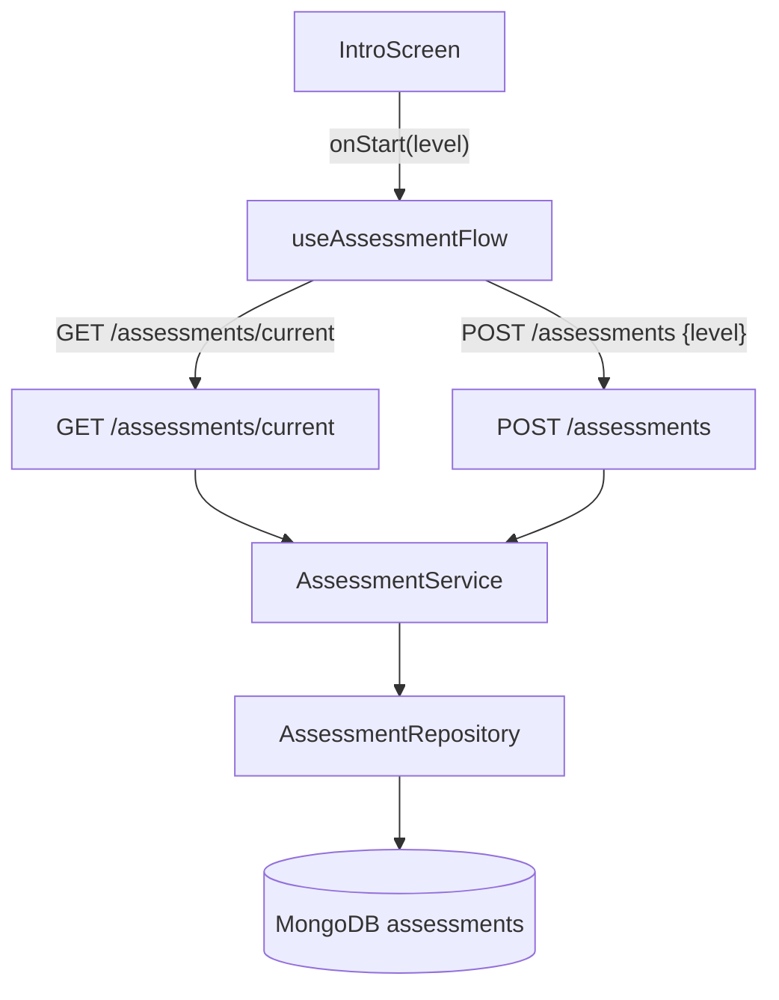
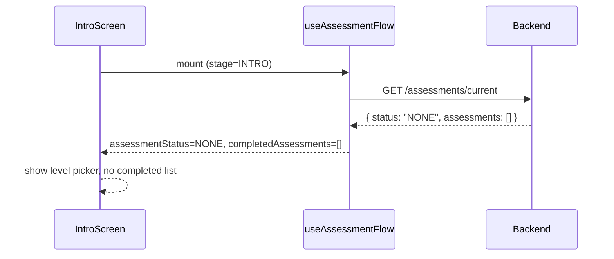
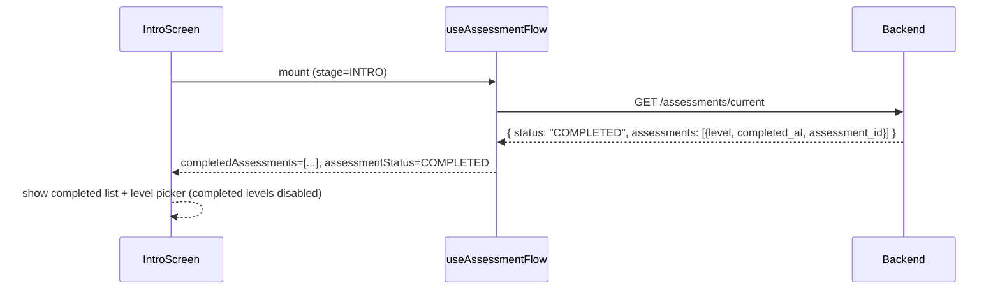
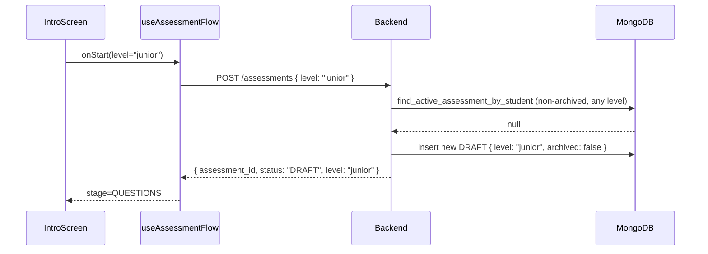
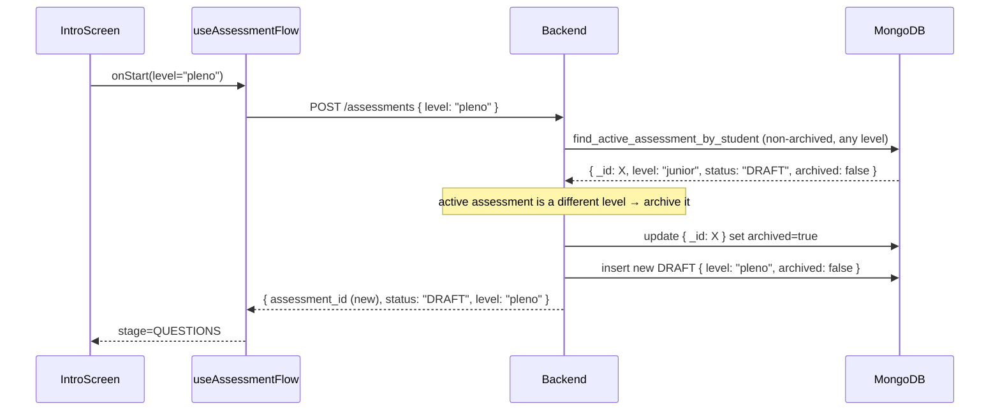
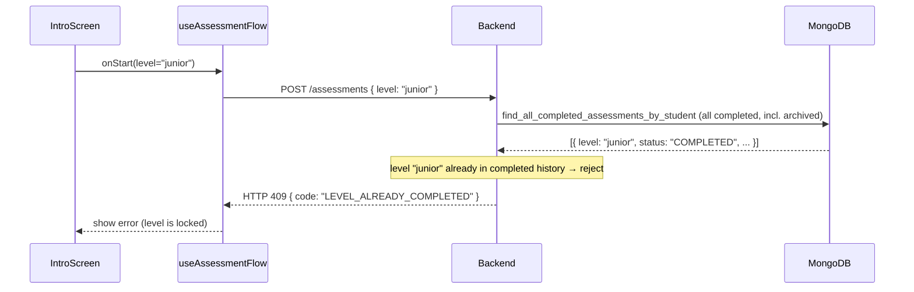
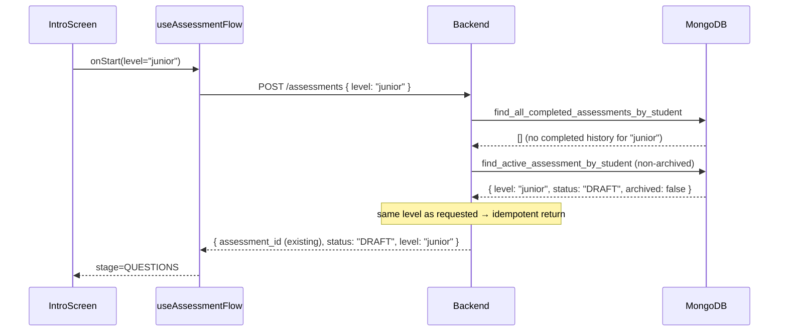

# Design Document: assessment-level-selection

## Overview

This feature extends the Introduction screen so that students can choose the difficulty level of their assessment before starting, and also see a summary of any previously completed assessments. A student always has **at most one active (non-archived) assessment** across all levels at any time. When a student picks a different level, their current active assessment is archived and a new DRAFT is created at the new level. A student who has already completed a level cannot start it again — completed levels are permanently locked regardless of whether the assessment is archived.

Five levels are available: `iniciante`, `junior`, `pleno`, `senior`, and `geral`. The `geral` level draws questions equally from all four categories (iniciante, junior, pleno, senior), splitting `assessment_question_count` evenly across them with remainder distributed round-robin starting from iniciante. All other business rules (one active assessment, completed-level lock, archiving) apply to `geral` identically to the other levels.

The `archived` flag enforces the "one active assessment at a time" invariant across levels. Archived assessments are excluded from active queries (resume, current status) but are preserved in history. The `assessments` array in `GET /assessments/current` returns the full completed history — all COMPLETED assessments including archived ones — so students can see every level they have ever finished.

The feature touches the backend domain model (adding `level` and `archived` to `Assessment`), the question-selection logic (filtering by exact level at the database query level), the API (accepting `level` on creation and returning it on summary), and the frontend Introduction screen (level picker + completed assessments list).

Students are identified in assessments by an application-level `student_id` field (a ULID generated at seed time), decoupled from the MongoDB `_id` (`ObjectId`). This keeps the identity layer independent of the storage layer.

---

## Architecture



---

## Sequence Diagrams

### Student opens Introduction screen (first visit)



### Student opens Introduction screen (has completed assessments)



### Student starts a new assessment (no prior active assessment)



### Student starts a different level (archives current active assessment)



### Student attempts to start an already-completed level



### Student resumes an existing DRAFT (same level)



---

## Components and Interfaces

### Backend: Assessment domain model

The `Assessment` document gains a `level` field and an `archived` flag. Existing documents without `level` are treated as `"iniciante"` (backward-compatible default). `archived: true` means the assessment has been superseded — the student moved to a different level and this one was archived to preserve the "one active assessment at a time" invariant. Archived assessments are excluded from active queries (resume, current status) but their completed history is still surfaced in the `assessments` array.

```python
class AssessmentLevel(str, Enum):
    INICIANTE = "iniciante"
    JUNIOR    = "junior"
    PLENO     = "pleno"
    SENIOR    = "senior"
    GERAL     = "geral"
```

`AssessmentLevel` values for `iniciante`/`junior`/`pleno`/`senior` match the `Category` enum directly, enabling a simple equality filter. `geral` is a meta-level that queries all four categories and distributes questions equally.

### Backend: Student identity — application-level student_id

Students have a dedicated `student_id` field (ULID string) generated at seed time, stored on the student document alongside `_id` (ObjectId). Assessment documents reference `student_id` (the ULID), not the MongoDB `_id`. This decouples identity from storage.

```python
# Student document shape (MongoDB)
{
  _id:        ObjectId,       # MongoDB internal key
  student_id: str,            # ULID — application-level identity
  cpf:        str,
  name:       str,
  birth_date: ISODate,
}

# Assessment document shape (MongoDB)
{
  _id:                   ObjectId,
  student_id:            str,    # ULID — references student.student_id, NOT student._id
  level:                 str,
  archived:              bool,   # true = superseded (student moved to a different level)
  assigned_question_ids: [ObjectId],
  answers:               [...],
  status:                "DRAFT" | "COMPLETED",
  started_at:            ISODate,
  completed_at:          ISODate | null,
}
```

The JWT auth context resolves `student_id` (ULID) from the token; services pass this ULID directly to the repository.

### Backend: AssessmentRepository — collection injection

The collection object is injected at construction time rather than resolved per-method call. All methods use `self.collection` directly.

```python
class AssessmentRepository:
    def __init__(self, collection, questions_collection):
        self.collection = collection
        self.questions_collection = questions_collection
```

Wiring in `main.py` lifespan:

```python
assessment_repository = AssessmentRepository(
    collection=assessments_collection(db),
    questions_collection=questions_collection(db),
)
```

### Backend: AssessmentRepository — key methods

```python
async def find_active_assessment_by_student(
    self, *, student_id: str
) -> dict | None:
    # Single query: { student_id, archived: { $ne: true } }
    # Returns the one non-archived assessment (DRAFT or COMPLETED), or None
    # At most one non-archived assessment exists per student at any time

async def find_all_completed_assessments_by_student(
    self, *, student_id: str
) -> list[dict]:
    # Query: { student_id, status: "COMPLETED" }  — includes archived ones
    # Returns ALL completed assessments (archived or not) for history display
    # Sorted by completed_at descending

async def archive_assessment(self, *, assessment_id: ObjectId) -> None:
    # Sets archived=true on the given document
    # Used when a student picks a different level

async def list_questions_for_level(self, *, level: str) -> list[dict]:
    # MongoDB query includes category filter: { category: level }
    # Returns only _id, number, category fields
    # NOTE: for level == "geral", use list_questions_for_geral() instead

async def list_questions_for_geral(self) -> list[dict]:
    # Fetches ALL questions (no category filter) — used when level == "geral"
    # Returns only _id, number, category fields

async def create_assessment(
    self,
    *,
    student_id: str,
    assigned_question_ids: list[ObjectId],
    level: str,
    now: datetime,
) -> dict:
    # Inserts document with student_id (ULID string), level, archived=False
```

`find_draft_assessment_by_student` (level-agnostic, queries by `student_id` ULID) is kept for session-restore compatibility.

### Backend: AssessmentService

```python
async def get_current_assessment(self, *, student_id: str) -> dict:
    # 1. Fetch the single non-archived assessment (active) via find_active_assessment_by_student
    # 2. Fetch ALL completed assessments (incl. archived) via find_all_completed_assessments_by_student
    # Returns:
    # {
    #   "status": "NONE" | "DRAFT" | "COMPLETED",
    #   "assessment_id": str | None,      # from the active (non-archived) assessment
    #   "completed_at": str | None,       # from the active assessment if COMPLETED
    #   "level": str | None,              # from the active assessment
    #   "assessments": [{ "assessment_id", "level", "completed_at" }]  # full history
    # }

async def create_assessment(self, *, student_id: str, level: str) -> dict:
    # 1. Check completed history (all completed, incl. archived) for this level
    #    → If found: raise AppError 409 LEVEL_ALREADY_COMPLETED
    # 2. Fetch the current active (non-archived) assessment
    #    → If same level and DRAFT: return it (idempotent)
    #    → If different level (any status): archive it, then create new DRAFT
    #    → If None: create new DRAFT
    # Returns: { "assessment_id": str, "status": "DRAFT", "level": str }
```

### Backend: Question selection — exact level, DB-filtered

`build_assigned_question_ids` no longer uses `LEVEL_CATEGORY_MAP`. Questions are filtered at the MongoDB query level by passing `level` as the `category` filter. Only questions whose `category` exactly matches the selected level are returned.

For `geral`, a separate function `build_geral_question_ids` handles equal distribution across all four categories.

```python
def build_assigned_question_ids(
    question_docs: list[dict],
    level: AssessmentLevel = AssessmentLevel.INICIANTE,
) -> list[ObjectId]:
    # question_docs already pre-filtered by category=level at DB level
    # select_questions_by_difficulty applies weighted distribution within the pool
    selected = select_questions_by_difficulty(question_docs, settings.assessment_question_count)
    return [q["_id"] for q in selected]

def build_geral_question_ids(question_docs: list[dict]) -> list[ObjectId]:
    # question_docs contains questions from ALL four categories
    # Distributes assessment_question_count equally across iniciante/junior/pleno/senior
    # Remainder distributed round-robin starting from iniciante
    #
    # per_category = assessment_question_count // 4
    # remainder    = assessment_question_count % 4
    # categories   = [iniciante, junior, pleno, senior]
    # counts[cat]  = per_category (+ 1 for the first `remainder` categories)
    # select counts[cat] questions from each category bucket
    ...
```

The repository method `list_questions_for_level(level)` issues the category filter to MongoDB:

```python
async def list_questions_for_level(self, *, level: str) -> list[dict]:
    return await self.questions_collection.find(
        {"category": level},
        {"_id": 1, "number": 1, "category": 1},
    ).to_list(length=None)

async def list_questions_for_geral(self) -> list[dict]:
    # No category filter — returns all questions
    return await self.questions_collection.find(
        {},
        {"_id": 1, "number": 1, "category": 1},
    ).to_list(length=None)
```

### Backend: API models

```python
class CreateAssessmentRequest(BaseModel):
    level: AssessmentLevel = AssessmentLevel.INICIANTE

class CreateAssessmentResponse(BaseModel):
    assessment_id: str
    status: str
    level: str

class CompletedAssessmentSummary(BaseModel):
    assessment_id: str
    level: str
    completed_at: str

class AssessmentSummaryResponse(BaseModel):
    status: str
    assessment_id: str | None = None
    completed_at: str | None = None
    level: str | None = None
    assessments: list[CompletedAssessmentSummary] = []
```

### Frontend: useAssessmentFlow hook

New state and changes:

```javascript
const [selectedLevel, setSelectedLevel] = useState("iniciante");
const [completedAssessments, setCompletedAssessments] = useState([]);
const [assessmentLevel, setAssessmentLevel] = useState(null);

// loadCurrentAssessment populates completedAssessments from data.assessments
// startAssessment(level) sends { level } in POST body
// session restore re-fetches /current to obtain level before redirecting to QUESTIONS
```

`startAssessment` signature:

```javascript
async function startAssessment(level) {
    // POST /assessments with body { level }
    // on success: setAssessmentLevel(data.level), setAssessmentId(data.assessment_id), setStage(STAGES.QUESTIONS)
    // on 409 LEVEL_ALREADY_COMPLETED: surface error to UI (level is locked)
}
```

### Frontend: IntroScreen component

Two new visual sections:

1. **Level picker** — shown when `assessmentStatus !== "DRAFT"`. One card per level. Selected level is highlighted. Levels present in `completedAssessments` are rendered with a "Concluído" badge and are **disabled** (not selectable) — completed levels are permanently locked. The "Iniciar avaliação" button is disabled while `isBusy`, no level is selected, or the selected level is already completed. Five levels are shown: Iniciante, Júnior, Pleno, Sênior, Geral.

2. **Completed assessments list** — shown when `completedAssessments.length > 0`. Displays level name and completion date per entry.

Props added to `IntroScreen`:

```javascript
completedAssessments,   // array of { assessment_id, level, completed_at }
selectedLevel,          // string: currently selected level
onLevelChange,          // (level: string) => void
```

---

## Data Models

### Assessment document (MongoDB)

```
{
  _id:                    ObjectId,
  student_id:             string (ULID),          // app-level identity, NOT ObjectId
  level:                  "iniciante" | "junior" | "pleno" | "senior" | "geral",
  archived:               boolean,                // true = superseded (student moved to a different level)
  assigned_question_ids:  [ObjectId],
  answers:                [{ question_id, selected_option, answered_at }],
  status:                 "DRAFT" | "COMPLETED",
  started_at:             ISODate,
  completed_at:           ISODate | null
}
```

Backward compatibility: documents without `level` are read as `"iniciante"`. Documents without `archived` are treated as `archived: false`.

At most one non-archived assessment exists per student at any time. When a student picks a new level, the current active assessment (if any) is archived before the new DRAFT is created.

### Student document (MongoDB)

```
{
  _id:        ObjectId,
  student_id: string (ULID),   // NEW — application-level identity
  cpf:        string,
  name:       string,
  birth_date: ISODate,
}
```

The `student_id` ULID is generated by the seed script using the `python-ulid` library (`from ulid import ULID; str(ULID())`) and stored at insert time. The JWT token carries this ULID as the subject claim.

### MongoDB indexes

Active assessment uniqueness per student (at most one non-archived per student):

```
{ student_id: 1, archived: 1 }
unique: true, partialFilterExpression: { archived: { $ne: true } }
```

This enforces the invariant that a student has at most one non-archived assessment at any time.

Student lookup by ULID:

```
{ student_id: 1 }
unique: true
```

Completed history lookup (for level-lock check and history display):

```
{ student_id: 1, status: 1, completed_at: -1 }
```

---

## Algorithmic Pseudocode

### create_assessment service method

```pascal
PROCEDURE create_assessment(student_id, level)
  INPUT: student_id: str (ULID), level: str
  OUTPUT: { assessment_id, status, level }

  ASSERT level IN AssessmentLevel.values()

  // Step 1: Check completed history (all completed, including archived) for this level
  // A completed level is permanently locked regardless of archived status
  completed_history ← repository.find_all_completed_assessments_by_student(
                          student_id=student_id
                      )
  completed_at_level ← first item in completed_history WHERE level = level

  IF completed_at_level IS NOT NULL THEN
    RAISE AppError(409, "LEVEL_ALREADY_COMPLETED",
                   "Este nível já foi concluído e não pode ser iniciado novamente.")
  END IF

  // Step 2: Fetch the single active (non-archived) assessment for this student
  active ← repository.find_active_assessment_by_student(student_id=student_id)

  // Step 3: Handle based on active assessment state
  IF active IS NOT NULL THEN
    IF active.level = level AND active.status = "DRAFT" THEN
      // Idempotent: same level, already a DRAFT — return it unchanged
      RETURN { assessment_id: str(active._id), status: "DRAFT", level: level }
    ELSE
      // Different level (or same level but COMPLETED — already handled above):
      // archive the current active assessment to enforce the one-active invariant
      repository.archive_assessment(assessment_id=active._id)
    END IF
  END IF

  // Step 4: Create new DRAFT at the requested level
  IF level = "geral" THEN
    question_docs ← repository.list_questions_for_geral()
    assigned_ids  ← build_geral_question_ids(question_docs)
  ELSE
    question_docs ← repository.list_questions_for_level(level=level)
    assigned_ids  ← build_assigned_question_ids(question_docs, level=level)
  END IF

  IF assigned_ids IS EMPTY THEN
    RAISE AppError(409, "NO_QUESTIONS_FOR_LEVEL",
                   "Não há questões disponíveis para o nível selecionado.")
  END IF

  now     ← datetime.now(UTC)
  created ← repository.create_assessment(
                student_id=student_id,
                assigned_question_ids=assigned_ids,
                level=level,
                now=now
            )

  RETURN { assessment_id: str(created._id), status: "DRAFT", level: level }
END PROCEDURE
```

**Preconditions:**
- `student_id` is a valid ULID string
- `level` is one of `iniciante | junior | pleno | senior | geral`

**Postconditions:**
- If `level` appears in the student's completed history (archived or not), raises `LEVEL_ALREADY_COMPLETED` — no document is created or modified
- If the active assessment is a DRAFT at the same level, it is returned unchanged (idempotent)
- If an active assessment exists at a different level, it is archived (`archived=true`) before the new DRAFT is created
- After the call, exactly one non-archived assessment exists for this student
- `assigned_question_ids` contains only questions whose `category` exactly equals `level`

### get_current_assessment service method

```pascal
PROCEDURE get_current_assessment(student_id)
  INPUT: student_id: str (ULID)
  OUTPUT: AssessmentSummaryResponse

  // Query 1: the single active (non-archived) assessment
  active ← repository.find_active_assessment_by_student(student_id=student_id)

  // Query 2: ALL completed assessments (including archived) for full history
  completed_history ← repository.find_all_completed_assessments_by_student(
                          student_id=student_id
                      )
  // sorted by completed_at DESC (repository returns them pre-sorted)

  assessments ← [
    { assessment_id: str(a._id), level: a.level ?? "iniciante",
      completed_at: a.completed_at.isoformat() }
    FOR a IN completed_history
  ]

  IF active IS NOT NULL THEN
    RETURN {
      status: active.status,
      assessment_id: str(active._id),
      completed_at: active.completed_at.isoformat() IF active.completed_at ELSE null,
      level: active.level ?? "iniciante",
      assessments: assessments
    }
  END IF

  RETURN { status: "NONE", assessment_id: null, completed_at: null, level: null, assessments: assessments }
END PROCEDURE
```

**Preconditions:**
- `student_id` is a valid ULID string

**Postconditions:**
- `assessments` contains ALL COMPLETED assessments for the student (archived or not), sorted by `completed_at` descending — this is the full history
- Top-level `status`, `assessment_id`, and `level` reflect the single non-archived (active) assessment only
- If no active assessment exists, `status` is `"NONE"` but `assessments` may still be non-empty (student has completed history from previous sessions)

### build_assigned_question_ids (updated — no in-Python filtering)

```pascal
PROCEDURE build_assigned_question_ids(question_docs, level)
  INPUT: question_docs: list[dict],  // already filtered by category=level at DB level
         level: AssessmentLevel
  OUTPUT: list[ObjectId]

  // No in-Python category filtering — DB already returned exact-level questions
  selected ← select_questions_by_difficulty(question_docs, settings.assessment_question_count)

  RETURN [q._id FOR q IN selected]
END PROCEDURE
```

**Preconditions:**
- `question_docs` contains only documents where `category == level` (guaranteed by DB query)
- `level` is a valid `AssessmentLevel`

**Postconditions:**
- All returned question IDs belong to the exact level category
- Count ≤ `settings.assessment_question_count`

---

### build_geral_question_ids

```pascal
PROCEDURE build_geral_question_ids(question_docs)
  INPUT: question_docs: list[dict]  // all questions from all categories (no filter)
  OUTPUT: list[ObjectId]

  n          ← settings.assessment_question_count
  categories ← [INICIANTE, JUNIOR, PLENO, SENIOR]

  // Bucket questions by category
  buckets ← { cat: [] FOR cat IN categories }
  FOR each q IN question_docs DO
    IF q.category IN buckets THEN
      buckets[q.category].append(q)
    END IF
  END FOR

  // Equal distribution with round-robin remainder
  per_category ← n // 4
  remainder    ← n % 4
  counts ← { cat: per_category FOR cat IN categories }
  FOR i IN range(remainder) DO
    counts[categories[i]] += 1
  END FOR

  // Select from each bucket (sorted by number for determinism)
  selected ← []
  FOR cat IN categories DO
    bucket ← sorted(buckets[cat], key=number)
    selected.extend(bucket[: counts[cat]])
  END FOR

  RETURN [q._id FOR q IN selected]
END PROCEDURE
```

**Preconditions:**
- `question_docs` contains questions from all four categories (fetched via `list_questions_for_geral`)
- `settings.assessment_question_count` is a positive integer

**Postconditions:**
- Total returned IDs ≤ `settings.assessment_question_count`
- Questions are drawn from all four categories as evenly as possible
- If any category has fewer questions than its allocated count, only available questions are returned for that category
- Remainder questions are allocated starting from `iniciante`

---

## Key Functions with Formal Specifications

### AssessmentService.create_assessment

**Preconditions:**
- `student_id` is a valid ULID string
- `level` ∈ `{"iniciante", "junior", "pleno", "senior", "geral"}`

**Postconditions:**
- If `level` appears in the student's completed history (archived or not), raises `AppError(409, "LEVEL_ALREADY_COMPLETED")` — no document is created or modified
- If the active (non-archived) assessment is a DRAFT at the same level, the same `assessment_id` is returned (idempotent)
- If an active assessment exists at a different level, it is archived and a new DRAFT is created at `level`
- After the call, exactly one non-archived assessment exists for this student
- `assigned_question_ids` only contains questions whose `category` exactly equals `level`

**Loop invariants:** N/A

### AssessmentService.get_current_assessment

**Preconditions:**
- `student_id` is a valid ULID string

**Postconditions:**
- Top-level `status`/`assessment_id`/`level` reflect the single non-archived assessment (or `"NONE"` if none exists)
- `assessments` contains ALL COMPLETED assessments for the student (archived or not), sorted by `completed_at` descending
- A student with no active assessment but completed history returns `status: "NONE"` with a non-empty `assessments` array

### AssessmentRepository.find_active_assessment_by_student

**Preconditions:**
- `student_id` is a valid ULID string

**Postconditions:**
- Returns the single document where `student_id` matches and `archived != true`, or `None`
- At most one such document exists (enforced by unique partial index)

### AssessmentRepository.find_all_completed_assessments_by_student

**Preconditions:**
- `student_id` is a valid ULID string

**Postconditions:**
- Returns all documents where `student_id` matches and `status == "COMPLETED"` — includes archived ones
- Sorted by `completed_at` descending
- Used for: level-lock check in `create_assessment`; history display in `get_current_assessment`

### AssessmentRepository.archive_assessment

**Preconditions:**
- `assessment_id` is a valid ObjectId of an existing assessment

**Postconditions:**
- The document's `archived` field is set to `true`
- No other fields are modified

### AssessmentRepository.list_questions_for_level

**Preconditions:**
- `level` is a valid `AssessmentLevel` value string (not `"geral"`)

**Postconditions:**
- Returns only documents where `category == level` (filter applied at MongoDB query level)
- Each document contains `_id`, `number`, and `category` fields

### AssessmentRepository.list_questions_for_geral

**Preconditions:** none (fetches all questions)

**Postconditions:**
- Returns all question documents regardless of category
- Each document contains `_id`, `number`, and `category` fields

### build_assigned_question_ids (DB-pre-filtered)

**Preconditions:**
- `question_docs` contains documents with `_id` and `category` fields, all with `category == level`
- `level` is a valid `AssessmentLevel` (not `"geral"`)

**Postconditions:**
- ∀ id ∈ result: the corresponding question's `category == level`
- `len(result)` ≤ `settings.assessment_question_count`

### build_geral_question_ids

**Preconditions:**
- `question_docs` contains questions from all four categories (returned by `list_questions_for_geral`)
- `settings.assessment_question_count` is a positive integer

**Postconditions:**
- `len(result)` ≤ `settings.assessment_question_count`
- Questions are drawn from all four categories with equal allocation (`assessment_question_count // 4` each, remainder round-robin from iniciante)
- ∀ id ∈ result: the corresponding question's `category` ∈ `{"iniciante", "junior", "pleno", "senior"}`

---

## Error Handling

### Invalid level value

**Condition:** `POST /assessments` body contains an unknown `level` string
**Response:** HTTP 422, `code: "VALIDATION_ERROR"`
**Recovery:** Pydantic validation on `CreateAssessmentRequest` rejects it before reaching the service

### Level already completed

**Condition:** `POST /assessments` is called for a level the student has already completed
**Response:** HTTP 409, `code: "LEVEL_ALREADY_COMPLETED"`, message: "Este nível já foi concluído e não pode ser iniciado novamente."
**Recovery:** Service raises `AppError` before creating any document; the frontend disables completed levels in the picker to prevent this in normal usage

### No questions available for level

**Condition:** The question pool for the chosen level is empty (no questions seeded for that category). For `geral`, this applies if any of the four categories has no questions.
**Response:** HTTP 409, `code: "NO_QUESTIONS_FOR_LEVEL"`, message: "Não há questões disponíveis para o nível selecionado."
**Recovery:** Service raises `AppError` before creating the assessment document

### Duplicate DRAFT for same level (race condition)

**Condition:** Two concurrent `POST /assessments` for the same student+level
**Response:** The second request returns the existing draft (idempotent, HTTP 200)
**Recovery:** `DuplicateKeyError` from MongoDB is caught; service re-fetches and returns the existing draft

---

## Testing Strategy

### Unit Testing Approach

- `test_assessment_service.py`: extend stub repository with `find_active_assessment_by_student`, `find_all_completed_assessments_by_student`, `archive_assessment`, and `list_questions_for_level`
- Stub `list_questions_for_level` returns pre-filtered docs (simulating DB-level filtering)
- Test `create_assessment`:
  - No active assessment, no history → creates new DRAFT
  - Active DRAFT at same level → returns existing DRAFT (idempotent)
  - Active DRAFT at different level → archives it, creates new DRAFT at new level
  - Active COMPLETED at different level → archives it, creates new DRAFT at new level
  - Level appears in completed history (archived or not) → raises `LEVEL_ALREADY_COMPLETED`
  - Empty question pool → raises `NO_QUESTIONS_FOR_LEVEL`
- Test `get_current_assessment`:
  - Active DRAFT + completed history → top-level reflects DRAFT, `assessments` = full history
  - Active COMPLETED + completed history → top-level reflects COMPLETED, `assessments` = full history
  - No active assessment + completed history → `status: "NONE"`, `assessments` = full history
  - Archived completed assessments appear in `assessments` (history includes archived)
- Test `build_assigned_question_ids`: all returned IDs belong to the exact level category
- Use ULID strings (e.g. `str(ULID())`) as `student_id` values in test fixtures

### Property-Based Testing Approach

**Property Test Library:** hypothesis

- For any valid `level` and any question pool (all pre-filtered to that level), every question ID returned by `build_assigned_question_ids` has `category == level`
- For any list of completed assessments (archived or not), `get_current_assessment` always returns all of them in `assessments`, sorted by `completed_at` descending
- For any student with no completed history at a level, calling `create_assessment` twice with the same level returns the same `assessment_id` and exactly one non-archived assessment exists
- For any student with an active assessment at level A, calling `create_assessment` with level B (B ≠ A, B not in completed history) results in the level-A assessment being archived and a new non-archived DRAFT at level B

### Integration Testing Approach

- `test_http_api.py`: `POST /assessments` with each valid level returns `{ assessment_id, status, level }`; invalid level returns HTTP 422; calling `POST /assessments` for a level in completed history returns HTTP 409 `LEVEL_ALREADY_COMPLETED`
- `POST /assessments` with a different level than the current active one archives the old assessment and returns a new DRAFT
- `GET /assessments/current` top-level fields reflect the non-archived assessment; `assessments` array includes all completed history (archived or not)
- Archived assessments do not appear as the top-level active assessment in `GET /assessments/current`

---

## Performance Considerations

- `find_active_assessment_by_student` issues a single MongoDB query returning at most one document — O(1) with the partial unique index.
- `find_all_completed_assessments_by_student` fetches the full completed history in one query; for typical students this is a small set (≤ 4 documents, one per level).
- `get_current_assessment` issues two queries (active + completed history) instead of one, but both are indexed and the result sets are tiny.
- `list_questions_for_level` pushes the category filter to MongoDB, reducing the document set transferred over the wire compared to fetching all questions and filtering in Python.
- The partial unique index `{ student_id: 1 }` on non-archived documents keeps active-assessment lookups O(1).

---

## Security Considerations

- `level` is validated by Pydantic against the `AssessmentLevel` enum before reaching the service — no injection risk.
- The JWT auth context is unchanged; `student_id` (ULID) is always taken from the verified token, never from the request body.
- `archived` is a server-side field; clients cannot set or unset it.
- A student cannot start an assessment for another student's level by manipulating the request.

---

## Dependencies

No new external dependencies beyond `python-ulid` (already required for seed scripts). All other changes are within the existing stack:
- Backend: FastAPI, Motor, Pydantic v2, PyMongo (existing)
- Frontend: React 19, native fetch (existing)
- New MongoDB index defined in `backend/app/db/indexes.py`
- `student_id` ULID generation uses the `python-ulid` library in the seed script: `from ulid import ULID; str(ULID())`

---

## Correctness Properties

*A property is a characteristic or behavior that should hold true across all valid executions of a system.*

### Property 1: Question category containment (exact match)

*For any* valid `AssessmentLevel` and any question pool returned by `list_questions_for_level(level)`, every question ID returned by `build_assigned_question_ids` must belong to a question whose `category` exactly equals `level`.

**Validates: Requirements 3.1, 3.2**

---

### Property 2: Question count bound

*For any* valid `AssessmentLevel` and any question pool, the number of question IDs returned by `build_assigned_question_ids` must be less than or equal to `settings.assessment_question_count`.

**Validates: Requirements 3.3**

---

### Property 3: Create assessment idempotency

*For any* student and valid level (with no existing completed assessment at that level), calling `create_assessment` twice with the same arguments must return the same `assessment_id` both times, and exactly one non-archived DRAFT document must exist for that student+level pair after both calls.

**Validates: Requirements 4.2**

---

### Property 4: Completed level is permanently locked (including archived history)

*For any* student and level for which a COMPLETED assessment exists — whether archived or not — calling `create_assessment` for that student+level must raise `LEVEL_ALREADY_COMPLETED` (HTTP 409). No new document is created and no existing document is modified. A student can never redo a level they have completed, even if the completed assessment was subsequently archived.

**Validates: Requirements 5.1**

---

### Property 5: At most one active assessment per student

*For any* student, at most one non-archived assessment exists at any time across all levels. After any call to `create_assessment` that results in a new DRAFT being created, the previously active assessment (if any, at any level) must have `archived=true`.

**Validates: Requirements 4.3, 4.5**

---

### Property 6: Completed assessments history completeness and ordering

*For any* student, the `assessments` array returned by `get_current_assessment` must contain ALL COMPLETED assessments for that student — including archived ones — sorted by `completed_at` descending. This is the full history. The top-level `status`/`assessment_id`/`level` fields reflect only the single non-archived (active) assessment.

**Validates: Requirements 6.3, 6.4**

---

### Property 7: Active assessment reflects non-archived state

*For any* student who has a non-archived assessment (DRAFT or COMPLETED), `get_current_assessment` must return that assessment's `status`, `assessment_id`, and `level` in the top-level fields. If no non-archived assessment exists, `status` must be `"NONE"`.

**Validates: Requirements 6.2, 6.5**

---

### Property 8: Completed levels are disabled in the level picker (full history)

*For any* `completedAssessments` array (which includes archived completed assessments), every level present in that array must be rendered with a "Concluído" badge in the IntroScreen level picker and must be **disabled** (not selectable). A student can never start a new assessment at any level they have ever completed, regardless of whether that completed assessment is archived.

**Validates: Requirements 8.3**

---

### Property 9: Start button disabled invariant

*For any* IntroScreen state where `isBusy` is `true`, `selectedLevel` is `null`/`undefined`, or the selected level is already completed, the "Iniciar avaliação" button must have its `disabled` attribute set.

**Validates: Requirements 8.5**

---

### Property 10: Completed assessments list completeness

*For any* non-empty `completedAssessments` array, the IntroScreen must render a list entry for every element, each entry displaying the level name and completion date.

**Validates: Requirements 9.1**

---

### Property 11: Hook propagates level to API

*For any* level value selected in the Hook, when `startAssessment` is invoked the outgoing `POST /assessments` request body must contain a `level` field equal to that selected value.

**Validates: Requirements 10.2**

---

### Property 12: Archived assessments excluded from active summary, included in history

*For any* student, no assessment with `archived=true` must appear as the top-level `assessment_id`/`status`/`level` in the response from `get_current_assessment`. However, archived assessments with `status: "COMPLETED"` MUST appear in the `assessments` history array — they are part of the student's permanent completed history.

**Validates: Requirements 6.2, 6.3**

---

### Property 13: Geral level equal distribution

*For any* question pool returned by `list_questions_for_geral`, `build_geral_question_ids` must return at most `assessment_question_count` IDs, with questions drawn from all four categories as evenly as possible (`assessment_question_count // 4` per category, remainder round-robin from iniciante). No question from a category outside `{iniciante, junior, pleno, senior}` is included.

**Validates: Requirements 3.5, 3.6**
