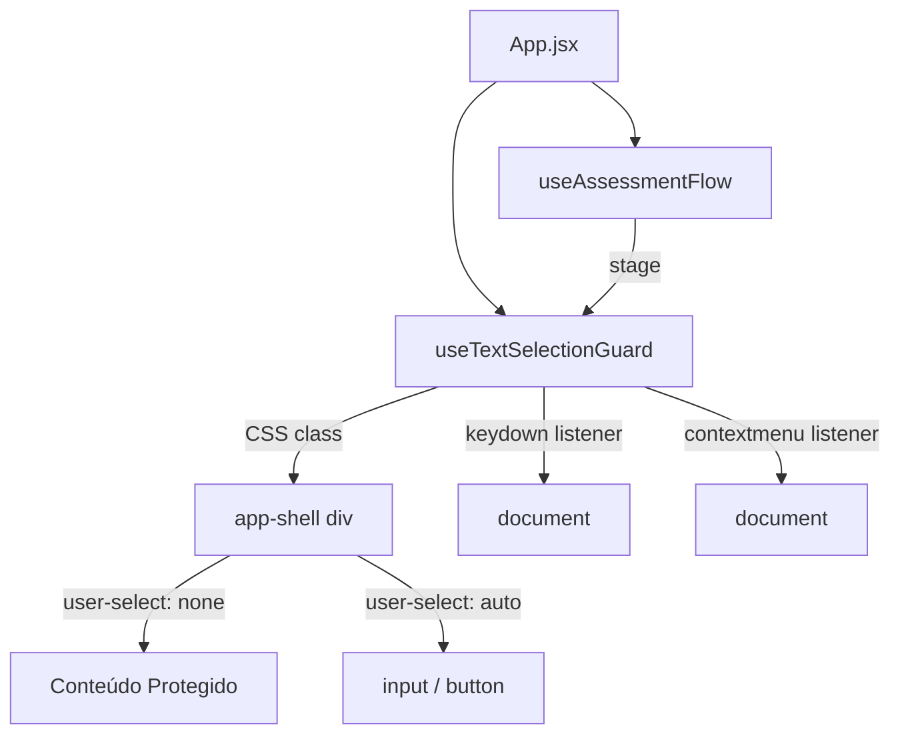

# Design Técnico — disable-text-selection

## Overview

Esta feature adiciona uma camada de proteção de conteúdo ao frontend da plataforma Kodie, impedindo que estudantes selecionem, copiem ou acessem o conteúdo das questões via atalhos de teclado ou menu de contexto durante os estágios `QUESTIONS` e `REVIEW` do fluxo de avaliação.

A implementação é inteiramente no frontend (React + CSS puro), sem nenhuma mudança no backend. A proteção é ativada e desativada de forma reativa ao estágio atual do fluxo, controlado pelo hook `useAssessmentFlow`.

**Decisão de design:** A proteção é implementada como um hook React (`useTextSelectionGuard`) que encapsula toda a lógica de event listeners e CSS, mantendo os componentes de tela sem estado e sem responsabilidade sobre a proteção. Isso segue o padrão arquitetural existente do projeto.

## Architecture



O hook `useTextSelectionGuard` recebe o `stage` atual e:
1. Adiciona/remove a classe CSS `no-select` no elemento `<main class="app-shell">` via `ref`
2. Registra/remove event listeners no `document` para `keydown` e `contextmenu`

A classe CSS `no-select` aplica `user-select: none` ao container, com exceção explícita para `input` e `button` via seletor CSS descendente.

## Components and Interfaces

### Hook: `useTextSelectionGuard(stage, containerRef)`

```js
// frontend/src/hooks/useTextSelectionGuard.js

/**
 * Ativa proteção de seleção/cópia de texto nos estágios QUESTIONS e REVIEW.
 *
 * @param {string} stage - Estágio atual do fluxo (valor do enum STAGES)
 * @param {React.RefObject<HTMLElement>} containerRef - Ref para o elemento raiz (app-shell)
 */
export function useTextSelectionGuard(stage, containerRef) { ... }
```

**Responsabilidades:**
- Determinar se o estágio atual é protegido (`QUESTIONS` ou `REVIEW`)
- Adicionar/remover a classe `no-select` no `containerRef.current`
- Registrar/remover listener `keydown` no `document` para bloquear `Ctrl/Cmd + C/A/X`
- Registrar/remover listener `contextmenu` no `document` para bloquear menu de contexto em elementos não-interativos

**Interface do event handler de teclado:**
```js
function handleKeyDown(event) {
  const isProtectedKey = ['c', 'a', 'x'].includes(event.key.toLowerCase());
  const isModified = event.ctrlKey || event.metaKey;
  if (isModified && isProtectedKey) {
    event.preventDefault();
  }
}
```

**Interface do event handler de contextmenu:**
```js
function handleContextMenu(event) {
  const isInteractive = event.target.closest('input, button') !== null;
  if (!isInteractive) {
    event.preventDefault();
  }
}
```

### Modificação: `App.jsx`

Adiciona um `ref` no elemento `<main>` e passa `stage` + `ref` para o hook:

```jsx
const containerRef = useRef(null);
useTextSelectionGuard(flow.stage, containerRef);

return <main className="app-shell" ref={containerRef}>...</main>;
```

### Modificação: `styles.css`

Nova classe utilitária adicionada ao final do arquivo:

```css
/* ─── Text selection guard ──────────────────────────────────────────────────── */

.no-select {
  user-select: none;
}

.no-select input,
.no-select button {
  user-select: auto;
}
```

## Data Models

Nenhum modelo de dados novo é necessário. A feature é puramente comportamental no frontend.

**Constante auxiliar** (interna ao hook, sem exportação):

```js
const PROTECTED_STAGES = new Set([STAGES.QUESTIONS, STAGES.REVIEW]);
```

Esta constante centraliza a definição de quais estágios ativam a proteção, tornando fácil adicionar ou remover estágios no futuro.


## Correctness Properties

*A property is a characteristic or behavior that should hold true across all valid executions of a system — essentially, a formal statement about what the system should do. Properties serve as the bridge between human-readable specifications and machine-verifiable correctness guarantees.*

**Reflexão sobre redundâncias antes de escrever as propriedades:**

- Critérios 2.1, 2.2, 2.3 e 2.4 descrevem o mesmo comportamento para teclas diferentes e estágios diferentes — podem ser unificados em uma única propriedade parametrizada por `(stage, key)`.
- Critérios 3.1 e 3.2 descrevem o mesmo comportamento para dois estágios — unificados em uma propriedade.
- Critérios 4.1, 4.2, 4.3 e 4.4 descrevem o mesmo invariante de escopo — unificados em uma propriedade.
- Critério 1.3 (interativos preservados) e 3.3 (contextmenu em interativos) são distintos e mantidos separados.
- Critério 1.4 é consequência visual do CSS e não é testável como propriedade de unidade — omitido.

Resultado: 5 propriedades distintas.

---

### Property 1: Proteção ativa se e somente se o estágio for protegido

*Para qualquer* valor de `stage` do enum `STAGES`, o container da aplicação deve ter a classe `no-select` aplicada se e somente se `stage` for `QUESTIONS` ou `REVIEW`.

**Validates: Requirements 1.1, 1.2, 4.1, 4.2, 4.3, 4.4**

---

### Property 2: Atalhos de cópia são bloqueados nos estágios protegidos

*Para qualquer* combinação de `(stage, key)` onde `stage ∈ {QUESTIONS, REVIEW}` e `key ∈ {c, a, x}`, um evento `keydown` com `ctrlKey=true` ou `metaKey=true` deve ter `preventDefault()` chamado.

**Validates: Requirements 2.1, 2.2, 2.3, 2.4**

---

### Property 3: Teclas não protegidas não são interceptadas

*Para qualquer* evento `keydown` onde a tecla não seja `c`, `a` ou `x` com modificador `Ctrl/Cmd`, o handler não deve chamar `preventDefault()`, independentemente do estágio.

**Validates: Requirements 2.5**

---

### Property 4: Menu de contexto bloqueado em conteúdo não-interativo, permitido em interativos

*Para qualquer* elemento alvo de um evento `contextmenu` nos estágios protegidos: se o elemento (ou seu ancestral mais próximo) for `input` ou `button`, `preventDefault()` não deve ser chamado; caso contrário, `preventDefault()` deve ser chamado.

**Validates: Requirements 3.1, 3.2, 3.3**

---

### Property 5: Controles interativos preservam user-select

*Para qualquer* elemento `input` ou `button` que seja descendente de um container com a classe `no-select`, a propriedade CSS `user-select` computada deve ser `auto` (não `none`).

**Validates: Requirements 1.3**

---

## Error Handling

Esta feature não introduz operações assíncronas nem estados de erro. Os únicos casos de falha silenciosa a considerar são:

| Situação | Comportamento esperado |
|---|---|
| `containerRef.current` é `null` no momento da ativação | O hook ignora a operação de classe CSS; os event listeners no `document` ainda são registrados normalmente |
| Navegador não suporta `user-select` sem prefixo | O CSS inclui `-webkit-user-select` como fallback |
| `event.target.closest` não disponível (navegador muito antigo) | Fora do escopo de suporte da plataforma |

O hook deve fazer cleanup completo dos event listeners no `useEffect` return para evitar memory leaks ao desmontar o componente ou ao mudar de estágio.

## Testing Strategy

Esta feature é adequada para property-based testing na camada de lógica do hook (handlers de evento), e para testes de exemplo na camada de integração com o DOM.

**Biblioteca PBT:** [fast-check](https://github.com/dubzzz/fast-check) (JavaScript, compatível com Vitest)

**Abordagem dual:**

- **Testes de exemplo** — verificam que a classe CSS é adicionada/removida corretamente para cada estágio concreto
- **Testes de propriedade** — verificam os handlers de evento com inputs gerados aleatoriamente (teclas, modificadores, elementos alvo)

**Configuração mínima:** 100 iterações por teste de propriedade (`numRuns: 100`).

**Tag format:** `// Feature: disable-text-selection, Property {N}: {texto}`

### Testes de exemplo (Vitest)

```
useTextSelectionGuard
  ✓ adiciona classe no-select quando stage=QUESTIONS
  ✓ adiciona classe no-select quando stage=REVIEW
  ✓ remove classe no-select quando stage=AUTH
  ✓ remove classe no-select quando stage=INTRO
  ✓ remove classe no-select quando stage=COMPLETED
  ✓ remove event listeners ao desmontar
```

### Testes de propriedade (fast-check)

```
Property 1: proteção ativa ↔ estágio protegido
  // Feature: disable-text-selection, Property 1
  fc.property(fc.constantFrom(...Object.values(STAGES)), (stage) => { ... })

Property 2: atalhos de cópia bloqueados nos estágios protegidos
  // Feature: disable-text-selection, Property 2
  fc.property(
    fc.constantFrom(STAGES.QUESTIONS, STAGES.REVIEW),
    fc.constantFrom('c', 'a', 'x'),
    fc.boolean(), // ctrlKey
    fc.boolean(), // metaKey (pelo menos um true)
    (stage, key, ctrl, meta) => { ... }
  )

Property 3: teclas não protegidas não são interceptadas
  // Feature: disable-text-selection, Property 3
  fc.property(
    fc.string({ minLength: 1, maxLength: 1 }).filter(k => !['c','a','x'].includes(k.toLowerCase())),
    (key) => { ... }
  )

Property 4: contextmenu bloqueado em não-interativos, permitido em interativos
  // Feature: disable-text-selection, Property 4
  fc.property(
    fc.constantFrom(STAGES.QUESTIONS, STAGES.REVIEW),
    fc.boolean(), // isInteractive
    (stage, isInteractive) => { ... }
  )
```

**Testes de integração (não-PBT):**
- Verificar que `App.jsx` passa o `ref` correto para o hook
- Verificar que a classe `no-select` está presente no DOM durante `QUESTIONS` em um render completo com React Testing Library
