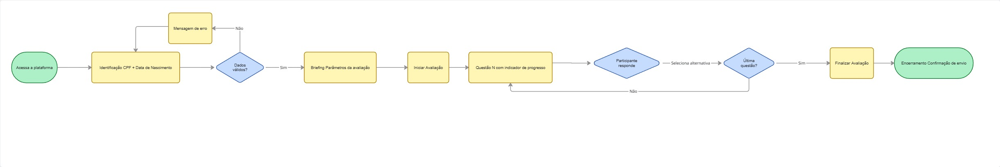
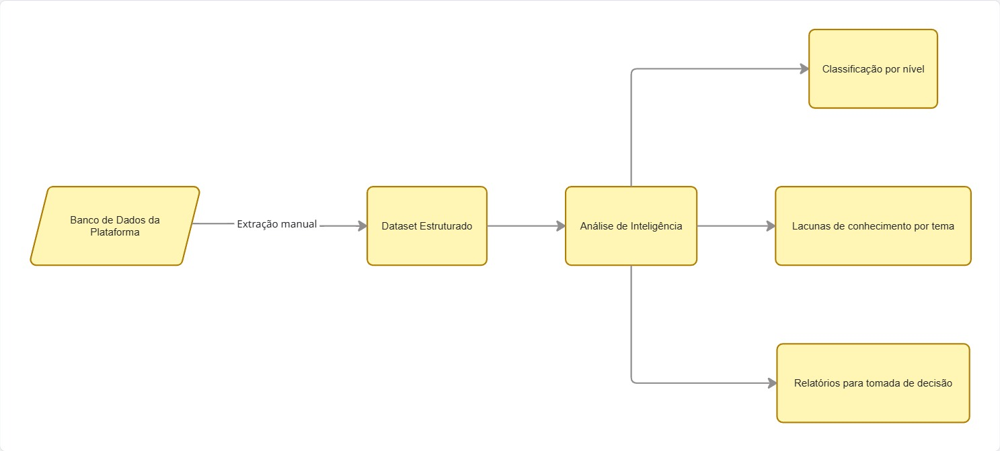

# Planejamento de Produto: Sistema de Avaliação

## 1. Visão de Produto

**O Problema:** A Kodie precisa mensurar o nível de conhecimento em tecnologia dos participantes de forma escalável, eliminando a dependência de avaliações manuais e ferramentas genéricas que dificultam a extração e análise de dados.

**A Solução:** Uma plataforma web *mobile-first*, de baixo atrito, que conduz o participante por um fluxo de avaliação estruturado e objetivo, gerando dados padronizados para a gestão da Kodie.

---

## 2. Personas

### Persona 1: O Participante (O Avaliado)
* **Contexto:** Familiaridade variável com tecnologia — justamente o que a avaliação busca mensurar. Acessa predominantemente via dispositivo móvel, com possível conexão intermitente.
* **Pontos de Fricção a Eliminar:** Falha no processo de identificação, perda de progresso por instabilidade de conexão.
* **Necessidade:** Fluxo simples e direto, sem ambiguidades.

### Persona 2: O Gestor/Instrutor da Kodie (O Consumidor dos Dados)
* **Contexto:** Disponibilidade de tempo reduzida. Necessita tomar decisões operacionais com base nos resultados — como classificação de participantes em trilhas iniciante ou avançada.
* **Necessidade:** Dados estruturados e prontos para análise.

---

## 3. Jornada do Participante

### A. Identificação
O participante acessa a plataforma e se identifica via CPF e data de nascimento. Credenciais inválidas bloqueiam o avanço com mensagem de erro.

### B. Briefing
Antes de iniciar, o participante é informado sobre o total de questões, o propósito da avaliação e que o progresso é salvo automaticamente.

### C. Avaliação
Fluxo de uma questão por tela. O participante pode selecionar uma alternativa ou indicar explicitamente que não sabe a resposta — o que gera dados mais precisos para diagnóstico de nível do que respostas aleatórias.

### D. Encerramento
Confirmação de envio com instrução sobre os próximos passos do processo seletivo da Kodie.

---

## 4. Fluxograma da Experiência do Participante

---

## 5. Extração de Dados e Análise de Inteligência (v1)

Nesta versão inicial, **a extração de dados será realizada de forma manual** pelo time da Kodie. Não há dashboard automatizado ou exportação self-service neste ciclo.

### Fluxo

### Responsabilidades
* **Plataforma (v1):** Coletar e armazenar respostas de forma estruturada e íntegra, garantindo disponibilidade para extração.
* **Time Kodie:** Executar a extração e conduzir as análises sobre o dataset gerado.

> **Evolução futura:** Automação da extração e dashboards analíticos são candidatos para versões subsequentes, a serem priorizados conforme o volume de participantes e a frequência de avaliações escalar.

---

## 6. Métricas de Sucesso (KPIs)

1. **Taxa de Conclusão:** Proporção entre participantes que iniciaram e os que concluíram a avaliação. Quedas expressivas em etapas intermediárias indicam pontos de abandono a investigar.
2. **Tempo Médio por Questão:** Identifica questões com enunciado ambíguo ou de complexidade desproporcional.
3. **Taxa de Falha no Login:** Proporção de tentativas de acesso sem sucesso. Indicador de inconsistências na base de participantes cadastrados.
